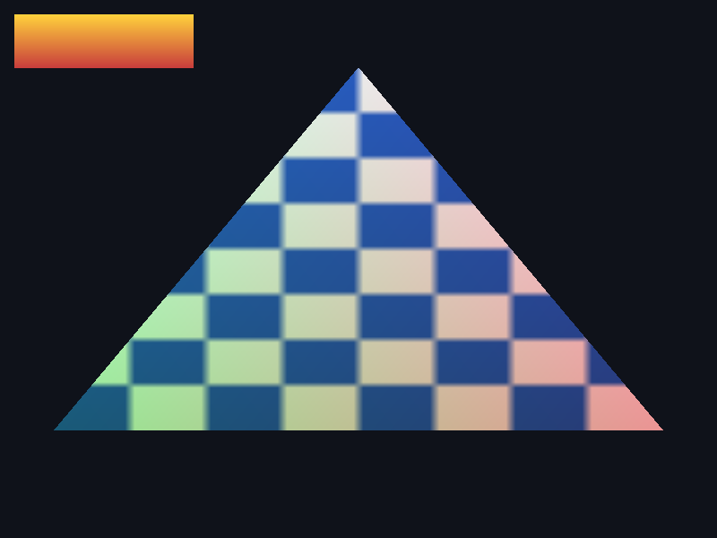

# Renderer spike — `DX8Wrapper`-shaped abstraction on Vulkan

A standalone proof-of-concept for the Phase 4 renderer question: *can the engine's Direct3D 8
call pattern be served by Vulkan (and therefore MoltenVK)?*

Read `docs/porting/renderer-surface.md` for the measured D3D8 surface, the Vulkan mapping table,
the recommendation, and the revised Phase 4 estimate. This README covers only how to build and
run the code.

**This is not wired into the game.** It has its own CMake project, is not referenced by the
top-level build, and touches no engine code. It cannot affect the Windows build.



800×600, read back from the Vulkan colour target and written as a PNG by the program itself:
a textured triangle (`D3DFVF_XYZ | D3DFVF_DIFFUSE | D3DFVF_TEX1`, stage 0 set to
`COLOROP=MODULATE`, `COLORARG1=TEXTURE`, `COLORARG2=DIFFUSE`) and, in the corner, an
alpha-blended screen-space quad (`D3DFVF_XYZRHW | D3DFVF_DIFFUSE`, no texture,
`COLOROP=SELECTARG1/DIFFUSE`). Two draws, two different state blocks, two lazily created
`VkPipeline`s.

## What it is

| File | Role |
|---|---|
| `src/render_backend.h` | the abstraction. Method names, argument order and semantics deliberately mirror `Core/Libraries/Source/WWVegas/WW3D2/dx8wrapper.h` |
| `src/d3d8_subset.h` | the D3D8 enum vocabulary the engine uses, redeclared so the spike needs no Windows SDK |
| `src/state_translate.{h,cpp}` | D3D8 enum → Vulkan enum mapping, the `PipelineKey` that decides what has to be baked into a pipeline, and FVF → vertex-input decoding |
| `src/vulkan_backend.cpp` | the backend: device setup, pipeline cache, sampler cache, D3D8-style mutable shadow state, draw submission, readback |
| `shaders/fixedfunc.vert` | vertex stage, including the `D3DFVF_XYZRHW` pretransformed path Vulkan has no equivalent for |
| `shaders/fixedfunc.frag` | the `SetTextureStageState` combiner cascade, interpreted at runtime from a uniform block |
| `src/main.cpp` | driver. Issues the calls in the engine's order, then proves the result by readback |
| `src/caps_probe.cpp` | `zh-caps-probe`: formats, features and limits, queried. No rendering |
| `src/feature_probe.cpp` | `zh-feature-probe`: nine rendered cases (DXT, stencil, render targets, depth, blending, two stages, dynamic buffers), each asserted by reading pixels back |
| `src/fixedfunc_tests.cpp` | `zh-fixedfunc-tests`: 50 pixel assertions over the measured fixed-function subset — the whole cascade, FVF, transforms, lighting, fog, raster state and texture formats |
| `src/resource_lock_tests.cpp` | `zh-resource-lock-tests`: the D3D8 `Lock`/`Unlock` contract over Vulkan — five of the eight usage classes in `renderer-resource-seam.md`, each asserted on read-back pixels or read-back bytes |
| `src/throughput.cpp` | `zh-throughput`: draw calls/sec, state changes/sec, and pipeline-creation cost |
| `tools/d3d8-surface-scan.py` | the measurement behind every number in `renderer-surface.md` |
| `tools/d3d8-lock-scan.py` | the resource-interface and lock/unlock measurement behind `renderer-resource-seam.md`; `--check` gates the class table |
| `tools/d3d8-lock-classes.json` | the usage class each lock/unlock site belongs to, keyed by file and function |
| `tools/texture-stage-scan.py` | the texture-stage cascade measurement in `fixed-function-measurements.md` |
| `tools/engine-usage-scan.py` | the FVF / transform / lighting / fog / raster / format measurement in the same doc |

The interesting parts, if you only read two: the pipeline cache in `vulkan_backend.cpp`
(D3D8 mutates one state at a time, Vulkan wants an immutable pipeline — this is the reconciliation)
and `shaders/fixedfunc.frag` (D3D8's texture-stage cascade has no Vulkan analogue at all).

## Prerequisites

- CMake ≥ 3.20, Ninja or Make, a C++17 compiler
- Vulkan headers + loader, and either `glslangValidator` or `glslc`
- optional: SDL2, for a real window instead of headless rendering
- optional: `VK_LAYER_KHRONOS_validation`, on by default when present

On Debian/Ubuntu:

```sh
sudo apt-get install -y cmake ninja-build libvulkan-dev vulkan-validationlayers \
                        glslang-tools vulkan-tools libsdl2-dev
# a CPU Vulkan device, if the machine has no GPU (this is how it was verified):
sudo apt-get install -y mesa-vulkan-drivers
```

On macOS (verified on an M1 Pro — see `docs/porting/moltenvk-findings.md`):

```sh
brew install cmake molten-vk vulkan-headers vulkan-loader vulkan-tools glslang \
             vulkan-validationlayers
```

The LunarG SDK works too. Two macOS quirks, neither of them a code problem:

- configure with `-DSPIKE_USE_SDL2=OFF`; Homebrew's SDL2 headers pull in `immintrin.h` and do not
  compile on arm64. Headless is the default path anyway.
- `export DYLD_LIBRARY_PATH=/opt/homebrew/lib`, or the loader cannot find the validation layer's
  dylib and the run proceeds *without* validation while still printing `validation messages: 0`.

## Build

```sh
cmake -S spikes/renderer -B /tmp/zh-renderer-build -G Ninja
cmake --build /tmp/zh-renderer-build
```

The shaders are compiled to SPIR-V as part of the build; there is nothing to do by hand.

## Run

Headless is the default and needs no display server:

```sh
/tmp/zh-renderer-build/zh-renderer-spike --out spike-triangle.png
```

Expected output:

```
device: llvmpipe (LLVM 15.0.7, 256 bits)
wrote spike-triangle.png (800x600), 2 VkPipeline(s) created for 2 draws
centre pixel rgba = 132,151,170,255
validation messages: 0
OK
```

It exits non-zero if nothing rasterised at the centre of the target, or if the validation layer
reported anything — so it is usable as a CI check, not just a demo.

On a headless box with no GPU, select the Mesa CPU device explicitly:

```sh
unset DISPLAY
export XDG_RUNTIME_DIR=/tmp/xdgrt && mkdir -p "$XDG_RUNTIME_DIR" && chmod 700 "$XDG_RUNTIME_DIR"
VK_ICD_FILENAMES=/usr/share/vulkan/icd.d/lvp_icd.x86_64.json \
  /tmp/zh-renderer-build/zh-renderer-spike --out spike-triangle.png
```

(`XDG_RUNTIME_DIR` and unsetting `DISPLAY` are needed because the loader otherwise tries the X11
surface path and fails with `BadMatch` on a headless display.)

With a window, if SDL2 was found at configure time — renders 240 frames, Esc or close to quit:

```sh
/tmp/zh-renderer-build/zh-renderer-spike --window
```

Options: `--window`, `--out <file.png>`, `--no-validation`, `--help`.

The committed `docs/spike-triangle.png` was run through `optipng`; the program's own output is the
same image but larger, since its built-in PNG writer uses stored (uncompressed) deflate blocks to
avoid a zlib dependency.

## The probes

Two extra binaries, built by the same project, answer what the two draws above cannot:

```sh
/tmp/zh-renderer-build/zh-caps-probe        # formats, features, limits, portability subset
/tmp/zh-renderer-build/zh-feature-probe     # nine rendered cases, each checked pixel by pixel
/tmp/zh-renderer-build/zh-fixedfunc-tests   # 50 fixed-function pixel assertions
/tmp/zh-renderer-build/zh-resource-lock-tests  # D3D8 Lock/Unlock usage classes, plus their cost
/tmp/zh-renderer-build/zh-throughput        # draw calls/sec, state changes/sec, pipeline cost
```

`zh-resource-lock-tests` implements the D3D8 lock contract the engine actually uses — whole-surface
write, partial rect, `D3DLOCK_READONLY` read-back, a whole mip chain locked at once and filled
afterwards, and a `D3DLOCK_DISCARD`/`D3DLOCK_NOOVERWRITE` dynamic vertex ring — and prints what each
cost in staging bytes, copies, submits and stalls. `docs/porting/renderer-resource-seam.md` explains
the classes and what is *not* covered.

`zh-fixedfunc-tests` covers the subset measured in `docs/porting/fixed-function-measurements.md`:
all 17 `D3DTOP_*` ops the engine can request across 8 stages, `COLORARG0`/`ALPHAARG0`,
`RESULTARG`, `BUMPENVMAP`, `TEXCOORDINDEX`, texture matrices, the 21 FVF declarations,
world/view/projection, directional/point/spot lighting, vertex and table fog, alpha test,
`ZBIAS`, scissor, stencil and 11 texture formats. Expected values are computed from D3D8's
definition of each operation in the test itself, not captured from the backend; cases whose
correct D3D8 behaviour is not determinable are printed `PEND` and asserted no further.

`zh-feature-probe` covers depth test, alpha blending, BC1/BC3 (with alpha and with a mip chain),
two texture stages in one draw, stencil write + test, render-to-texture, and dynamic buffer
suballocation. Both exit non-zero on failure. Results on Apple Silicon:
`docs/porting/moltenvk-findings.md`.

## Reproduce the measurements

```sh
python3 spikes/renderer/tools/d3d8-surface-scan.py     # the D3D8 method surface
python3 spikes/renderer/tools/texture-stage-scan.py    # the texture-stage cascade
python3 spikes/renderer/tools/engine-usage-scan.py     # FVF, transforms, lighting, fog, raster
```

`texture-stage-scan.py` folds the literal `SetTextureStageState` sites into per-stage snapshots
*and* enumerates `ShaderClass::Apply()` over its 624 reachable shader states, because most of the
cascade is generated at runtime and a grep alone undercounts it. `engine-usage-scan.py` also
prints the `VkPipeline` count estimate. Both list every call site whose stage or value is not a
compile-time constant, so their numbers are lower bounds with the uncertainty attached rather
than estimates. Output is analysed in `docs/porting/fixed-function-measurements.md`.

`d3d8-surface-scan.py` prints the `IDirect3DDevice8` / `IDirect3D8` method tables with per-method macro vs. direct call
counts, the `D3DX*` entry points, the top files by call-site count, the `D3DRS_*` / `D3DTSS_*` /
`D3DTOP_*` / `D3DFVF_*` / `D3DFMT_*` / `D3DPOOL_*` / `D3DLOCK_*` usage histograms, and the `dx8*`
line count. Add `--json` to dump every individual call site. Methodology and its known limitations
are documented in `docs/porting/renderer-surface.md`.

## What this does and does not prove

Verified working on `llvmpipe (LLVM 15.0.7)`, Vulkan 1.1, validation layer enabled, zero
validation messages:

- D3D8's one-state-at-a-time mutable model reconciled with immutable `VkPipeline`s, via a shadow
  state block hashed into a pipeline cache and materialised lazily at draw time
- `SetTextureStageState`'s combiner cascade interpreted in a fragment shader from a uniform block:
  all 17 `D3DTOP_*` ops the engine can request, over 8 stages, with the
  `COMPLEMENT`/`ALPHAREPLICATE` modifiers, `COLORARG0`/`ALPHAARG0`, `RESULTARG`, `BUMPENVMAP`,
  `TEXCOORDINDEX` and the `D3DTS_TEXTURE0..3` matrices
- the fixed-function vertex pipeline: world/view/projection, ambient + directional + point + spot
  lighting, material colour sources, and vertex/table fog
- FVF bitfields decoded into `VkVertexInputAttributeDescription`s, including `D3DFVF_XYZRHW`,
  four texture-coordinate sets of sizes 1–4, and `D3DFVF_XYZB4 | LASTBETA_UBYTE4` (declaration
  only — no bone palette is applied)
- 11 non-block texture formats uploaded and sampled, including the palettised `P8` expanded on
  the CPU because Vulkan has no palette
- `Clear` as `vkCmdClearAttachments` inside the pass, preserving D3D8's mid-frame semantics
- alpha test as a shader `discard`, since Vulkan has none
- sampler cache keyed on D3D8 *stage* filter/address state, which in Vulkan is *object* state
- correctness asserted by reading the colour target back, not by looking at it

Also verified on `Apple M1 Pro` / macOS 26.6.1 / MoltenVK 1.4.2, validation layer enabled, zero
validation messages: the readback is pixel-identical to the Linux image above to within 1/255 on
every one of the 480,000 pixels (`docs/spike-triangle-macos.png`). This needed the
`VK_KHR_portability_enumeration` / `VK_KHR_portability_subset` opt-in that the first version of the
backend lacked — without it `vkCreateInstance` returns `VK_ERROR_INCOMPATIBLE_DRIVER`. The full
measurement, including what MoltenVK does *not* provide, is in `docs/porting/moltenvk-findings.md`.

Also not implemented *in the backend*, and none of it should be assumed: vertex blending / bone
palettes (`D3DRS_VERTEXBLEND`, `D3DTS_WORLDMATRIX(n)`), per-light specular, `SetRenderTarget` and
render-to-texture, ps.1.1/vs.1.1 translation, mipmap generation, cube/volume textures,
`CopyRects`, `DrawPrimitiveUP`, `ProcessVertices`, dynamic buffer rings, `D3DPOOL_MANAGED` shadow
copies, and device loss. (`zh-feature-probe` shows the *driver* handles render targets, DXT,
mipmaps and dynamic buffers correctly — that is a different claim from the backend implementing
them.) There is a hard cap of 64 draws per frame. The full list, with the reasoning, is in
`docs/porting/renderer-surface.md` §2 and `docs/porting/fixed-function-measurements.md` §7.
